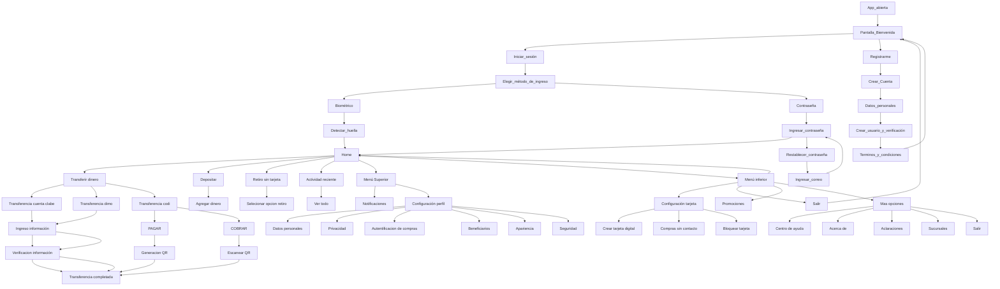

## App Movil

```mermaid
flowchart TD

%% AUTENTICACION

A[App_abierta] --> B[Pantalla_Bienvenida]

B --> C[Iniciar_sesión]
B --> D[Registrarme]

C --> E[Elegir_método_de_ingreso]
E --> F[Biométrico]
E --> G[Contraseña]

F --> H[Detectar_huella]
H --> I[Home]

G --> J[Ingresar_contraseña]
J --> I
J --> K[Restablecer_contraseña]
K --> L[Ingresar_correo]
L --> J

%% REGISTRAR CUENTA
D --> M[Crear_Cuenta]
M --> N[Datos_personales]
N --> O[Crear_usuario_y_verificación]
O --> P[Terminos_y_condiciones] 
P--> B

%% HOME Y NAVEGACION PRINCIPAL

I --> Q[Transferir dinero]
I --> R[Depositar]
I --> S[Retiro sin tarjeta]
I --> T[Actividad reciente]

%% MENU SUPERIOR

I --> U[Menú Superior]

U --> V[Notificaciones]
U --> W[Configuración perfil]

%% MENU INFERIOR

I --> X[Menú inferior]

X --> I[Home]
X --> Z[Configuración tarjeta]
X --> AA[Salir]
X --> AB[Promociones]
X --> AC[Mas opciones]

%% MENU SUPERIOR FLUJO CONFIGURACION PERFIL

W --> AD[Datos personales]
W --> AE[Privacidad]
W --> AF[Autentificacion de compras]
W --> AG[Beneficiarios]
W --> AH[Apariencia]
W --> AI[Seguridad]

%% MENU INFERIOR FLUJO CONFIGURACION TARJETA

Z --> AJ[Crear tarjeta digital]
Z --> AK[Compras sin contacto]
Z --> AL[Bloquear tarjeta]

%% MENU INFERIOR FLUJO SALIR

AA --> B

%% MENU INFERIOR FLUJO MAS OPCIONES

AC --> AM[Centro de ayuda]
AC --> AN[Acerca de]
AC --> AO[Aclaraciones]
AC --> AP[Sucursales]
AC --> AQ[Salir]

%% FLUJO PANTALLA HOME TRANSFERIR

Q --> AR[Transferencia cuenta clabe]
Q --> AS[Transferencia dimo]
Q --> AT[Transferencia codi]

%% FLUJO PANTALLA HOME DEPOSITAR

R --> AU[Agregar dinero]

%% FLUJO PANTALLA HOME RETIRO SIN TARJETA

S --> AV[Selecionar opcion retiro]

%% FLUJO PANTALLA HOME ACTIVIDAD RECIENTE

T --> AW[Ver todo]

%% FLUJO TRANSFERENCIA CLABE

AR --> AX[Ingreso información]
AX --> AY[Verificacion información]
AY --> AZ[Transferencia completada]

%% FLUJO TRANSFERENCIA DIMO

AS --> AX[Ingreso información]
AX --> AY[Verificacion información]
AY --> AZ[Transferencia completada]

%% FLUJO TRANSFERENCIA CODI 

AT --> AAA[PAGAR]
AT --> AAB[COBRAR]

%% FLUJO TRANSFERENCIA CODI PAGAR

AAA --> AAC[Generacion QR]
AAC --> AZ[Transferencia completada]

%% FLUJO TRANSFERENCIA CODI COBRAR

AAB --> AAD[Escanear QR]
AAD --> AZ[Transferencia completada]

```