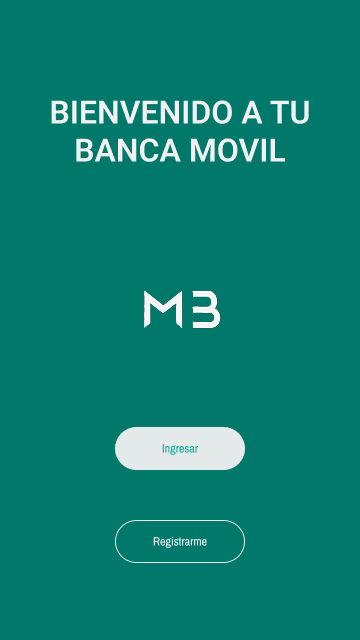
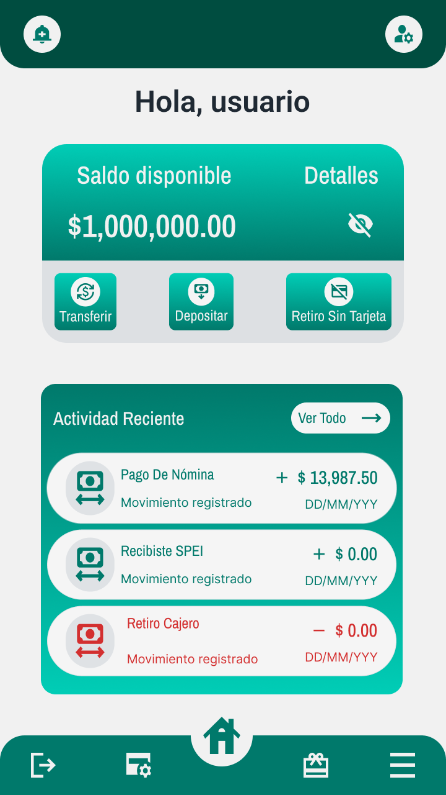

# 🏦 Plataforma Bancaria

Proyecto de desarrollo de una **plataforma bancaria integral**, diseñada para gestionar servicios financieros a través de distintos canales digitales y sistemas internos del banco.

El sistema está compuesto por múltiples aplicaciones y servicios que trabajan de forma integrada para permitir operaciones bancarias seguras tanto para **clientes** como para **usuarios internos del banco**.

---

## Vista previa de la aplicación móvil

<p align="center">
  
  
</p>

---

# 🎯 Objetivo del Proyecto

Desarrollar un ecosistema bancario que permita centralizar la gestión de operaciones financieras mediante diferentes interfaces tecnológicas:

* Aplicación móvil para clientes
* Portal web
* Sistema interno del banco (Core Bancario)
* Integración con sistemas externos de pagos electrónicos

---

# 🧩 Componentes del Sistema

## 📱 Aplicación Móvil

Aplicación dirigida a clientes del banco que permitirá realizar operaciones financieras desde dispositivos móviles.

Funciones principales:

* Consulta de cuentas
* Transferencias entre cuentas
* Transferencias interbancarias
* Consulta de movimientos
* Gestión de perfil de usuario

---

## 🌐 Portal Web

Portal web que permitirá a los clientes acceder a los servicios bancarios desde un navegador.

Funciones principales:

* Acceso a cuentas
* Consulta de historial de transacciones
* Transferencias
* Gestión de datos personales

---

## 🖥️ Aplicación de Escritorio (Core Bancario)

Aplicación interna utilizada por el personal del banco para la gestión administrativa del sistema financiero.

Funciones principales:

* Gestión de clientes
* Apertura de cuentas
* Administración de transacciones
* Supervisión de operaciones
* Control administrativo del sistema

---

## 🔗 Web Service de Integración con SPEI

Servicio encargado de la comunicación con el sistema de pagos interbancarios **SPEI**.

Este componente permite:

* Envío de transferencias interbancarias
* Recepción de transferencias
* Validación de operaciones
* Comunicación segura con servicios externos

---

# 🏗️ Arquitectura del Sistema

El sistema sigue una arquitectura **modular basada en servicios**, donde cada componente cumple una función específica dentro del ecosistema bancario.

Arquitectura general:

Cliente (App móvil / Web)
⬇
Servicios Backend / API
⬇
Core Bancario
⬇
Integraciones externas (SPEI)

---

# 📂 Estructura del Repositorio

```bash
APLICACION-BANCARIA
│
├── DOCUMENTACION
│   ├── Diagrama-flujo-navegacion-app.md
│   └── UI
│       ├── UI.md
│       └── imagenes
│
├── app-movil
├── portal-web
├── core-bancario
└── spei-webservice
```

---

# 🛠️ Tecnologías (Planeadas)

Dependiendo del avance del proyecto, se planea utilizar tecnologías como:

Backend

* Java
* Spring Boot
* REST API

Frontend

* React / Angular
* HTML5
* CSS3
* JavaScript

Mobile

* Flutter / React Native / Android

Base de datos

* PostgreSQL
* MySQL

Integración

* Web Services
* APIs REST

---

# 📸 Diseño de Interfaces

Los diseños de las pantallas de la aplicación se encuentran documentados en la carpeta:

```
DOCUMENTACION/UI
```

Incluyen:

* Pantalla de Login
* Pantalla principal
* Flujo de navegación
* Pantallas de transferencias

---

# 📚 Documentación

La documentación del proyecto incluye:

* Diagramas de flujo
* Diseño de interfaces
* Navegación de la aplicación
* Arquitectura del sistema

Ubicación:

```
DOCUMENTACION/
```

---

# 🚀 Estado del Proyecto

Proyecto en fase de **diseño y arquitectura**, con documentación inicial de flujos, pantallas y estructura del sistema.

---

# 👨‍💻 Autor

Desarrollado como proyecto de arquitectura y desarrollo de un sistema bancario multiplataforma.
